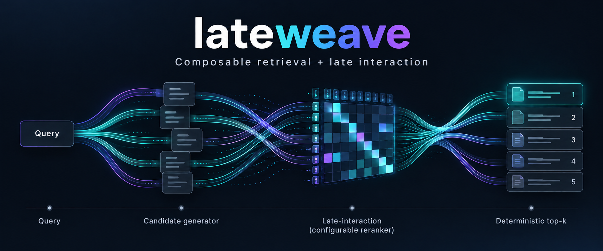

<div align="center">
  <h1>LateWeave</h1>
</div>

<p align="center">
  
</p>

[](https://github.com/pau-mensa/lateweave/actions/workflows/ci.yml)
[](https://crates.io/crates/lateweave)
[](https://docs.rs/lateweave)
[](https://pypi.org/project/lateweave/)
[](https://pypi.org/project/lateweave/)
[](https://crates.io/crates/lateweave)
[](https://github.com/pau-mensa/lateweave/blob/main/LICENSE)

`lateweave` is a Rust library, with Python bindings, for composing retrieval
pipelines out of engines it does not implement:

```text
Query -> CandidateGenerator -> [Reranker] -> deterministic top-k
```

A `Query` is raw text plus named features, each stamped with the
`Representation` (encoder identity) that produced it and materialized at most
once. Stages name documents by their corpus and the ID the system of record
gives them, never by an engine's internal position, so each stage reads its own
indexes and whoever maintains them, in any process and with any library, never
coordinates with lateweave or with the other stages. Every stage result says
when the index it read last committed; a search ranks only the documents every
stage holds and reports the oldest of those commits as `as_of`. The reranker
is optional: without one, gather scores rank.

The package supplies:

- `Query`, `Feature`, `Candidate`, `Gathered`, `Scored`, `Representation`;
- the `CandidateGenerator`, `Reranker`, and `MultiVectorSource` contracts;
- `SearchPipeline`: compatibility checks, optional rerank, subset enforcement,
  deterministic ranking, freshness, provenance, timings;
- `MaxSimReranker` over one `MultiVectorSource` per corpus, backed by a packed
  CPU MaxSim kernel (SGEMM, SIMD maximum reduction, bounded token batches,
  worker pools);
- `VectorStore`, a reader of memory-mapped multi-vector stores for gatherers,
  such as BM25, that keep no document vectors, and `VectorStoreWriter`, one
  writer of their [documented format](https://github.com/pau-mensa/lateweave/blob/main/STORE_FORMAT.md).

All of it is implemented once, in the `lateweave` crate, which builds without
PyO3 or NumPy. The Python package is a binding over that crate: a Python
gatherer, reranker, or source is adapted to the Rust contracts, and the
pipeline, MaxSim, and stores run natively.

Nothing in the package names an engine. bm25s, FastPLAID, NextPlaid and others
appear only in cookbooks.

## Installation

### Python

```bash
pip install lateweave
```

Wheels are published for CPython 3.11 to 3.14 on:

| Platform | Wheel | SGEMM |
|---|---|---|
| Linux x86_64, aarch64 | `manylinux_2_28` (glibc 2.28+) | OpenBLAS, vendored in the wheel |
| macOS arm64 | macOS 11+ | Accelerate |
| macOS x86_64 | macOS 10.15+ | Accelerate |

Nothing needs to be installed on the host: the Linux wheels carry their own
OpenBLAS. Elsewhere pip builds from the source distribution, which needs a Rust
toolchain and uses the bundled pure-Rust SGEMM (see
[Building from source](#building-from-source)).

### Rust

```bash
cargo add lateweave
```

The crate needs Rust 1.85 or later and, by default, no system library. On
Linux, enable the `openblas` feature for the faster kernel if the machine has
`libopenblas.so.0`:

```toml
[dependencies]
lateweave = { version = "0.1", features = ["openblas"] }
```

## Layout

```text
Cargo.toml          the `lateweave` crate (workspace root)
src/                pipeline, stages, MaxSim kernel and reranker, stores
examples/           Rust usage
bindings/python/    `lateweave-python`: the PyO3 module `lateweave._native`
python/lateweave/   the Representation dataclass, protocols, type stubs
STORE_FORMAT.md     the vector store on disk, for writers outside lateweave
```

## Using it from Rust

```rust
use std::sync::Arc;
use lateweave::{
    Feature, MaxSimReranker, MultiVectorSource, Query, SearchPipeline, SearchRequest,
    TokenMatrix, VectorStore, DEFAULT_FEATURE,
};

let store = Arc::new(VectorStore::open("index/vectors")?);
let representation = store.representation().clone();
let gatherer = Arc::new(MyLexicalIndex::open("index/lexical")?);  // impl CandidateGenerator
let reranker = MaxSimReranker::new([store as Arc<dyn MultiVectorSource>], DEFAULT_FEATURE)?;
let pipeline = SearchPipeline::new(gatherer, Some(Arc::new(reranker)));

let query = Query::new("prescripción de una deuda tributaria").with_feature(
    DEFAULT_FEATURE,
    Feature::lazy(representation, move || {
        TokenMatrix::new(encode(&text), dimension)
    }),
);
let result = pipeline.search(&query, &SearchRequest::new(500, 100))?;
println!("reflects every write committed before {:?}", result.as_of);
for document in &result.documents {
    println!("{} {:?} {}", document.rank, document.key, document.score);
}
```

Stage and source errors from outside lateweave travel as `Error::External`.
[examples/stored_maxsim.rs](https://github.com/pau-mensa/lateweave/blob/main/examples/stored_maxsim.rs) is a complete program:
`cargo run --example stored_maxsim`.

## Building from source

```bash
cargo test                 # the Rust library and its example
pip install maturin
maturin build --release    # the Python wheel
```

That default build has no external library dependency: the MaxSim kernel's
SGEMM comes from the bundled pure-Rust `matrixmultiply`, so the library links
and the extension imports on any host. [CONTRIBUTING.md](https://github.com/pau-mensa/lateweave/blob/main/CONTRIBUTING.md)
has the full development setup.

For a deployment, take the OpenBLAS kernel instead, as the published Linux
wheels do: about 1.75x faster on the shapes this kernel sees, bit-identical
results. Rust dependents enable the crate's `openblas` feature; the wheel
forwards the same feature:

```bash
maturin build --release --features pyo3/extension-module,openblas
```

`maturin` runs auditwheel's repair step, which **vendors** `libopenblas.so.0`
into `lateweave.libs/` inside the wheel. So this is self-contained too: it needs
OpenBLAS on the machine that *builds* the wheel, not on the machines that
install it. Set `OPENBLAS_LIB_DIR` if `libopenblas.so.0` lives outside the
linker's default search path.

Two things to know about that command line:

- `pyo3/extension-module` must be repeated. `--features` replaces the list in
  `[tool.maturin]` instead of extending it, and without `extension-module`
  pyo3 links `libpython`, which auditwheel then bundles into the wheel.
- The library lateweave needs exports the plain Fortran symbol `sgemm_`.
  `scipy-openblas32` on PyPI does not qualify -- it is a real threaded
  OpenBLAS, but every symbol carries a `scipy_` prefix.

macOS needs no feature flag: Accelerate ships with the OS and is used
automatically.
[ARCHITECTURE.md](https://github.com/pau-mensa/lateweave/blob/main/ARCHITECTURE.md#the-sgemm-dependency)
explains why Linux does not have an equivalent default.

## Queries and features

```python
from lateweave import Feature, Query, Representation

representation = Representation(
    encoder="lightonai/LateOn-Code", encoder_revision="main", dimension=128, normalized=True
)
query = Query(
    "CUDA_ERROR_ILLEGAL_ADDRESS after switching to bf16 attention",
    multi_vector=Feature(representation, provider=lambda: encode(text)),
)
```

`provider` runs the first time a stage asks for the feature, so a text-only
gatherer never pays for encoding, and a gatherer and reranker share one matrix.
A stage that needs the feature from another encoder is refused before anything
runs.

## Implementing a gatherer

```python
from lateweave import Candidate, Gathered


class MyGatherer:
    requires = {}                      # consumes query.text only
    score_semantics = "my-gather-score"

    def __init__(self, engine, corpus):
        self.engine = engine
        self.corpus = corpus

    def gather(self, query, limit, *, subset=None):
        searcher = self.engine.searcher()          # one consistent state of the index
        accept = None if subset is None else lambda id: subset.allows(self.corpus, id)
        hits = searcher.search(query.text, limit=limit, accept=accept)
        return Gathered(
            [Candidate(self.corpus, hit.id, hit.score, rank, "my-engine") for rank, hit in enumerate(hits)],
            searcher.committed_at,                 # an aware datetime
        )
```

A candidate names its corpus and its document ID; how the engine finds either
is its own business. `as_of` is when the index state the gatherer read was
committed: every write committed before it is reflected in the candidates. It
is the commit time, not the time the gatherer reloaded.

`subset` is `None`, or a `lateweave.Subset` naming, per corpus, either the
documents the search may return (`Subset().including(corpus, ids)`) or the ones
it must not (`.excluding(corpus, ids)`); `subset.allows(corpus, id)` answers
for one document and `subset.restriction(corpus)` returns `("only" | "except",
ids)`. A corpus it does not name contributes nothing, and an ID the index does
not hold is simply not a candidate. A gatherer that cannot honour it
must raise; the pipeline refuses a candidate outside the subset. A gatherer
that consumes a vector feature declares it: `requires = {"multi_vector":
representation}`. `requires` and `score_semantics` are read once, when the
`SearchPipeline` is built.

One gatherer may search several corpora, such as two indexes whose hits it
fuses, reporting the older of their commits.

## Freshness

Indexes move while a service searches them, each at its own pace. The pipeline
needs nothing from whoever moves them beyond what every stage reports:

- A document is ranked only when every stage holds it. A candidate the
  reranker's index does not hold scores `None` and is dropped, counted in
  `diagnostics["dropped"]`. So a delete is served as soon as *any* index
  applies it, and an insert once *all* of them have.
- `result.as_of` is the oldest commit among the indexes the search read: every
  write committed to all of them before it is reflected in the result. What
  to do with an answer older than a service tolerates, whether to fail, warn,
  or serve it anyway, is the service's policy:

```python
from datetime import datetime, timedelta, timezone

result = pipeline.search(query, gather_limit=500, limit=100)
if datetime.now(timezone.utc) - result.as_of > timedelta(minutes=1):
    ...
```

An index that is idle still has to say it is current, or it looks older than
it is: a writer commits periodically even with nothing to write, as
`VectorStoreWriter.commit()` does.

## Implementing a reranker or a source

A reranker owns whatever it needs to score. When what it needs is the token
vectors of candidate documents, implement `MultiVectorSource` over them, one
per corpus, and let `MaxSimReranker` do the scoring:

```python
from lateweave import MaxSimReranker


class EngineVectors:
    """Token vectors an engine already holds; no second copy."""

    representation = representation
    score_semantics = "engine-reconstructed-full-maxsim"

    def __init__(self, engine, corpus):
        self.engine = engine
        self.corpus = corpus

    def view(self):
        return EngineView(self.engine.snapshot())   # one consistent state, with .as_of


class EngineView:
    def __init__(self, snapshot):
        self.snapshot = snapshot
        self.as_of = snapshot.committed_at

    def document_lengths(self, document_ids):
        return {item: self.snapshot.length(item) for item in document_ids if item in self.snapshot}

    def fetch(self, document_ids, *, threads=None):
        rows = [self.snapshot.vectors(item) for item in document_ids]   # float32 [tokens, D]
        return np.concatenate(rows), np.asarray([len(r) for r in rows], dtype=np.int64)


reranker = MaxSimReranker([EngineVectors(laws_engine, "laws"), EngineVectors(cases_engine, "cases")])
```

Each rerank takes one view of every source and reads it throughout. A document
a view leaves out of `document_lengths` is unscored; a candidate from a corpus
with no source is an error. A `VectorStore` passed as a source is read
natively, without calling back into Python.

Or write a reranker directly:

```python
from lateweave import Scored


class MyReranker:
    requires = {"multi_vector": representation}
    score_semantics = "my-qualified-score-semantics"

    def rerank(self, query, candidates, *, budget):
        vectors = query.feature("multi_vector", representation)
        state = self.index.snapshot()
        return Scored([state.score(vectors, c.document_id) for c in candidates], state.committed_at)
```

The pipeline requires exactly one score or `None` per candidate, in candidate
order, never NaN.

## Stores

A `VectorStore` holds the vectors of one corpus for gatherers without document
vectors, and carries the `Representation` of its vectors, so it refuses
queries from any other encoder. lateweave only reads stores; the
[format](https://github.com/pau-mensa/lateweave/blob/main/STORE_FORMAT.md) is plain `.npy` files, document IDs as JSON, and
`manifest.json`, so any process can write one. `VectorStoreWriter` is the
writer lateweave ships:

```python
from lateweave import MaxSimReranker, SearchPipeline, VectorStore, VectorStoreWriter

# The indexing process.
writer = VectorStoreWriter.create("index/vectors", "laws", representation, encoding="float32")
writer.append(ids, packed_embeddings, lengths)     # replaces any document with the same ID
writer.delete(["law-17"])
writer.commit()                                    # publishes both together
writer.compact()                                   # whenever convenient: reclaims space only
writer.commit()

# The serving process.
pipeline = SearchPipeline(gatherer, MaxSimReranker([VectorStore("index/vectors")]))
```

| Encoding | Bytes per token | Score semantics |
|---|---|---|
| `float32` | `4D` | `float32-exact-full-maxsim` |
| `int8` | `D + 4` | `int8-reconstructed-approximate-full-maxsim` |

Appends write a new segment and deletes a tombstone file; nothing is rewritten
until a compaction, which changes no result. `VectorStore.view()` returns the
last commit, loading only what it has not seen; views taken earlier keep
reading their own commit.

See [ARCHITECTURE.md](https://github.com/pau-mensa/lateweave/blob/main/ARCHITECTURE.md) for the ownership rules and
[cookbook/README.md](https://github.com/pau-mensa/lateweave/blob/main/cookbook/README.md) for the BM25 recipe.

## Contributing

Issues and pull requests are welcome; see
[CONTRIBUTING.md](https://github.com/pau-mensa/lateweave/blob/main/CONTRIBUTING.md) for the development setup and
[CHANGELOG.md](https://github.com/pau-mensa/lateweave/blob/main/CHANGELOG.md) for what changed in each release.
Please report security issues privately, as described in
[SECURITY.md](https://github.com/pau-mensa/lateweave/blob/main/SECURITY.md).

## License

Licensed under the [Apache License, Version 2.0](https://github.com/pau-mensa/lateweave/blob/main/LICENSE). The
batching and SIMD reduction in the MaxSim kernel derive from
[maxsim-cpu](https://github.com/mixedbread-ai/maxsim-cpu); see
[NOTICE](https://github.com/pau-mensa/lateweave/blob/main/NOTICE).
